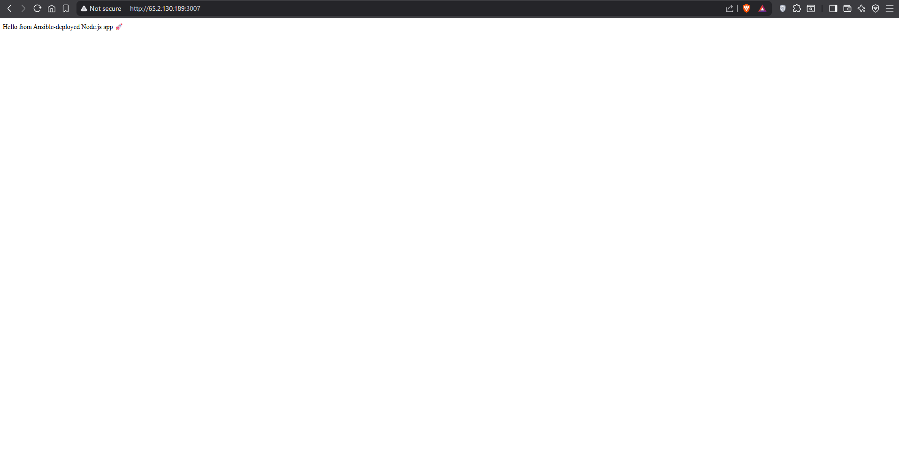

# 🚀 Ansible Node.js App Deployment  

This project demonstrates **automated deployment of a Node.js application on AWS EC2** using **Ansible**.  

---

## 📌 Features
- Launches an **EC2 instance** on AWS automatically.  
- Installs **Node.js and Git** on the server.  
- Clones this GitHub repository on the EC2 instance.  
- Installs dependencies with `npm install`.  
- Starts the app on **port 3007**.  

---

## 📂 Project Structure
ansible-node-app/
│── server.js # Node.js + Express application
|── ansible.cfg
│── package-lock.json
│── package.json # Dependencies & metadata
│── playbook.yml # Ansible playbook to automate EC2 + deployment
└── README.md

⚙️ Prerequisites

|-- AWS Account with access keys

|-- AWS CLI installed and configured

|-- Ansible installed

|-- Node.js (for local testing)

🚀 Deployment Steps
    1. Clone this repo
        git clone https://github.com/Sachin-Patkari/ansible-node-app.git
        cd ansible-node-app

    2. Configure AWS CLI
        aws configure

    3. Run Ansible Playbook
        ansible-playbook playbook.yml

    This will:

    Launch a new EC2 instance

    Install Node.js & Git

    Clone this repo

    Run the app on port 3007

🌐 Access the App

Once deployment is done:

Get your EC2 instance Public IP from the AWS Console or from the playbook output.

Open in browser:

http://<EC2_PUBLIC_IP>:3007

THIS IS HOW THE APP WILL DISPLAY
 